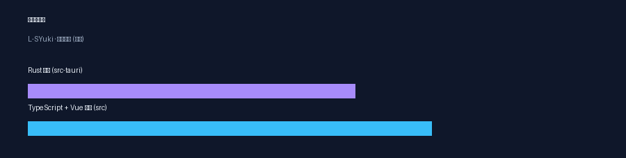
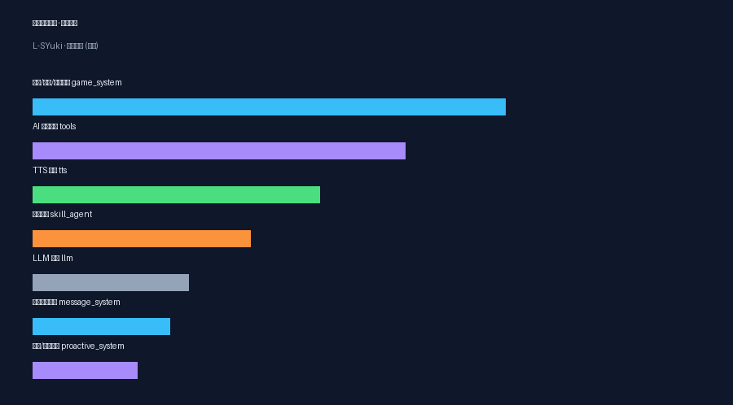
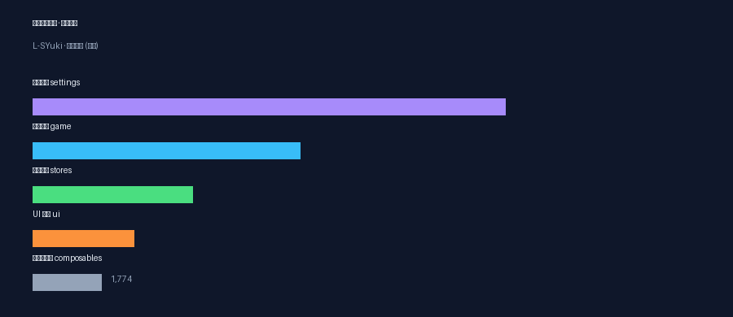

# SYuki · LingChat 改造版

<div align="center">

> 一个搭载了 SYuki「魂」的灵动 AI 陪伴助手
>
> 基于开源 [LingChat](https://github.com/SlimeBoyOwO/LingChat)（Tauri 2 + Vue 3 + Rust）深度改造，
> 把 SYuki 的差异化能力搬进 LingChat 原生体系。

[](https://github.com/sukiiiimansui-dotcom/SYuki/releases/tag/v0.1.0)
[-red?style=flat-square)](https://github.com/sukiiiimansui-dotcom/SYuki/releases/tag/v0.1.0)
[](https://www.rust-lang.org/)
[](https://vuejs.org/)

**L-SYuki** — 搭 LingChat 的车，注入 SYuki 的魂。

</div>

---

## 📥 下载 / Release

> ⚠️ **平台说明：目前仅提供 Android APK，iOS / Windows / Linux / macOS 等平台暂未提供**（受技术、版权、发布与分发流程等因素限制）。跨平台适配与发布尚未打通。

- **v0.1.0（pre-alpha，含大量 bug，仅作尝鲜）** → [GitHub Release](https://github.com/sukiiiimansui-dotcom/SYuki/releases/tag/v0.1.0) · 资产 `SYuki-v0.1.0-universal.apk`（universal 全 ABI，已签名、可安装）
- 安装包与说明见 [`RELEASE_NOTES.md`](RELEASE_NOTES.md)（含已知问题 / 平台说明）。
- 反馈 / 提 issue → [Issues](https://github.com/sukiiiimansui-dotcom/SYuki/issues)；当前为快速迭代 pre-alpha，接口 / 存储可能随时变动。

---

## 📌 这是什么

`SYuki` 是基于开源项目 **LingChat**（Tauri 2 + Vue 3 + Rust，聊天 + 剧本引擎 + 角色卡）改造的 AI 陪伴 App。
目标是「搭 LingChat 的车，注入 SYuki 的魂」——把 SYuki 特色的 B站学习 / 网易云音乐 / 分层记忆 / 主动心跳等能力，以 LingChat 原生方式迁移进来。

主要技术栈：

| 层 | 技术 |
|---|---|
| 界面 | Vue 3 + TypeScript + Tailwind |
| 后端 | Rust（Tauri 2）+ onnxruntime（本地 TTS / 情绪模型） |
| 内核 | 角色卡 / 剧本引擎 / 技能代理 / 主动系统 / 记忆库 / 插件沙箱 |

### 代码规模

| 模块 | 行数 |
|---|---|
| Rust 后端（`src-tauri`） | ~52.8k |
| TS + Vue 前端（`src`） | ~65.2k |



---

## ✨ 核心功能

LingChat 原生已内置：角色卡换装 / 立绘、剧本引擎（多事件 + script_editor）、技能 Agent、上帝 Agent、主动系统、工具 function-calling、多 TTS 适配器、记忆库、局域网同步、插件沙箱、番茄钟 / 日程 / 成就。

**SYuki 差异化能力（本次移植重点）：**

1. **🧠 分层记忆系统（L1-L4）**：每角色独立记忆库，自动压缩 短期回顾 / 长期经历 / 用户画像 / 约定，多记忆不混。
2. **🎵 网易云音乐**：搜索 / 心情推荐 / **App 级全局后台播放**（切页/玩游戏不停，独立音量），AI 可发歌给前端自动播。
3. **📺 B站学习**：为 AI 提供 B站网络文化（热榜 / 搜索 / 弹幕梗 / 高赞评论学习库），AI 可按聊天趋向自主搜索并灵活调用工具。
4. **💗 主动 + 心跳系统**：用户离开一段时间 → AI 主动想念搭话；主动投放可走上帝 Agent 多角色自主接话。
5. **🌐 AI 工具系统**：搜索 / 天气 / 音乐 / 屏幕 / 休息等，AI function-calling 灵活调用，全部开关可在设置界面一键启用。
6. **🧠 记忆可视化（本批新增）**：记忆图谱 · **无限沙盒**（自由缩放/拖动）· **分层视图**（L1 近期 / L2 长期 / L3 用户 / L4 约定 4 大球 + 食物链方向连线）· **点大球展开该层记忆** · **点记忆球查看「关联最强 Top-4」浮窗** · **类别卡片**（长条区块点击展开）· **情绪雷达**（五维心情 + 时间线）· **小窗悬浮**（可拖拽 / 最小化 / 全屏）。
7. **📈 主动状态可视化 + 心跳/主动专用日志**：AI 是否在想念（运行状态 / 想念次数 / 兴趣值 / 当前感知 / 待投放队列），主动事件写入 `data/log/heartbeat/heartbeat_YYYYMMDD.log`。
8. **⚡ 演出流畅度（本批移植）**：消息合并 + 事件队列调度优化 —— 同角色连续短句自动合并续打、AUTO 与台词合并共用单管道调度，减少切句闪断/卡顿。位置：`src/core/events/dialogue-merge.ts`（合并状态）、`src/core/events/event-queue.ts`（武装判定+队列）、`src/components/views/MainChat.vue`（自动推进/合并调度）、`src/components/game/standard/GameDialog.vue`（合并追加显示）、`src/stores/modules/settings/index.ts`（`mergeLineThreshold/mergeLineDelay/autoAdvanceDelay` 配置）。

> 所有移植功能的开关都已注册进设置界面（`config/tree.rs` → 设置面板「高级设置」），像 LingChat 原生功能一样可开可关。

---

## 🎛️ 功能模块构成

| 后端模块 | 行数 | 前端模块 | 行数 |
|---|---|---|---|
| 游戏/角色/记忆系统 | 6624 | 设置界面 | 12134 |
| AI 工具系统 | 5227 | 游戏渲染 | 6880 |
| TTS 语音 | 4028 | 状态管理 | 4112 |
| 技能代理 | 3058 | UI 组件 | 2612 |
| LLM 接入 | 2191 | 组合式函数 | 1774 |
| 对话消息系统 | 1927 | | |
| 主动/心跳系统 | 1463 | | |



<br/>



---

## 🚀 快速开始

### 环境
- Rust（stable）+ Android NDK（构建 APK 用）
- Node.js + pnpm（前端）
- Android SDK

### 开发运行

```bash
pnpm install
pnpm tauri dev        # 桌面端开发
```

### 构建 Android APK

```bash
bash build_setup.sh                 # 一次性准备环境（rustup + ndk + target）
node scripts/prepare-bundled-resources.mjs 9   # 打包 data.7z
pnpm tauri android build --target aarch64     # 构建 arm64 APK
```

> 本机构建若遇 `ort-sys` 报 `could not determine cache directory`，设置 `ORT_CACHE_DIR` 环境变量绕过：
> `ORT_CACHE_DIR=$HOME/.cache/ort cargo build --lib`

---

## 🧩 移植对照（SYuki → L-SYuki）

| SYuki 资产 | L-SYuki 落地 |
|---|---|
| `setting_prompt.txt` 人设 | 角色卡 `settings.yml` 的 `system_prompt` |
| `rikka_memory.db`（L1-L4） | `memory_bank` 表 + `PersistentMemorySystem`（按角色隔离） |
| `jukebox_engine` / `music_login` | `netmusic_service` + `tools/netmusic` + 全局播放器 |
| `bili_learn` | `bilibili_service` + `tools/bilibili` + 知识注入对话 |
| `emotion_engine` | `emotion/classifier`（ONNX） |
| `autopilot`（主动） | `proactive_system` + `god_agent` |

---

## 📦 仓库结构

> **源代码区分**：本仓库主体是 **L-SYuki 改造版**；原版上游 LingChat 的说明归置在 `upstream/`。

### 🧩 原版 vs 改造版

| 路径 | 说明 |
|---|---|
| **`upstream/`** | 原版上游 LingChat → 来源说明 / 许可参考（见 `upstream/README.md`） |
| **代码区（本仓库）** | 下图中的 `src/`、`src-tauri/` 等，即 **L-SYuki 改造版** |

### 📁 目录

```
upstream/         原版上游 LingChat（来源标识 / 许可参考）

src/              Vue3 前端（界面 / 视图 / 组件 / store）        ← L-SYuki
src-tauri/        Rust 后端（Tauri 2，RustPython 插件沙箱）      ← L-SYuki
src-tauri/src/ai_service/   核心：记忆 / 主动 / 工具 / TTS / 剧本引擎  ← L-SYuki
data/game_data/  角色卡 / 剧本 / 资源                           ← L-SYuki
scripts/         构建脚本（prepare-bundled-resources 等）        ← L-SYuki
docs/            文档与资产
```

---

## 📄 上游项目

本仓库基于 [LingChat](https://github.com/SlimeBoyOwO/LingChat) 改造，遵循其开源许可。原项目功能与社区支持请见上游仓库。

## 📝 License

本项目是上游 [LingChat](https://github.com/SlimeBoyOwO/LingChat) 的**衍生改造版**，遵循其开源许可：

- **许可证**：**GNU Affero General Public License v3.0（AGPL-3.0）**（完整文本见 [`LICENSE`](LICENSE)）
- **署名与修改说明**：见 [`NOTICE`](NOTICE)（Copyright © SlimeBoyOwO；本仓库为 L-SYuki 改造版，修改项见 [`docs/L-SYuki-changes.md`](docs/L-SYuki-changes.md)）
- **源码区分**：原版上游说明见 [`upstream/`](upstream/)，本仓库代码区（src / src-tauri / data）为 L-SYuki 改造版


---

<div align="center">

**L-SYuki · 一个会记着你、会想你、会陪你学习的 AI 陪伴。**

</div>


---

## 📚 相关文档

- [SYuki 源项目 · 具体功能说明](docs/SYuki-original-features.md) —— 改造前的原 SYuki 全部功能
- [L-SYuki · 我们改了什么](docs/L-SYuki-changes.md) —— SYuki → L-SYuki 迁移对照与本仓库改动详解
