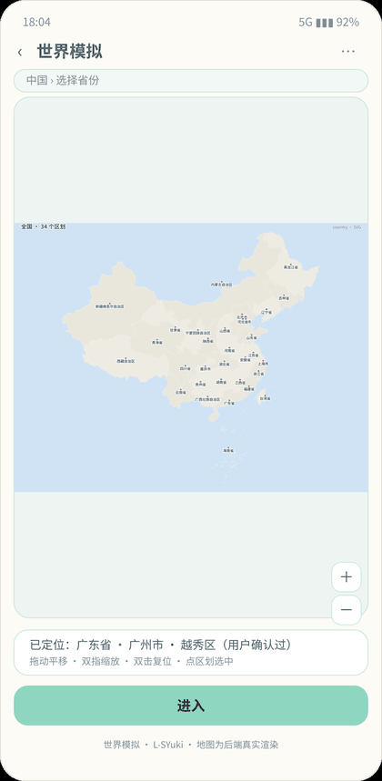
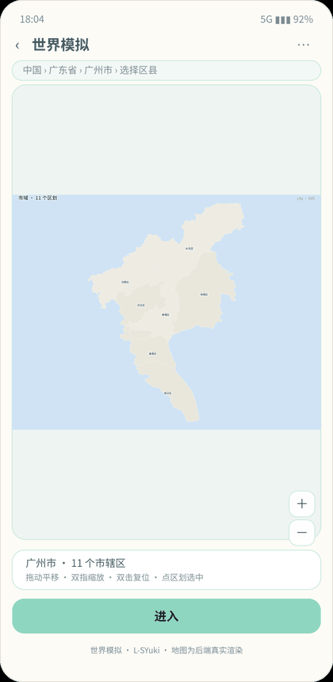
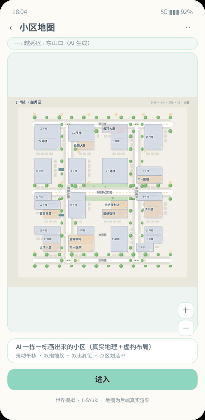
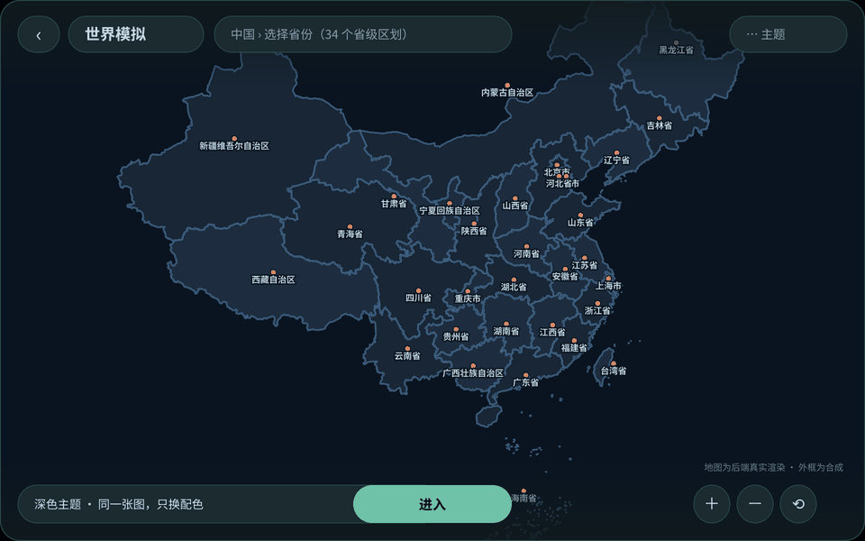
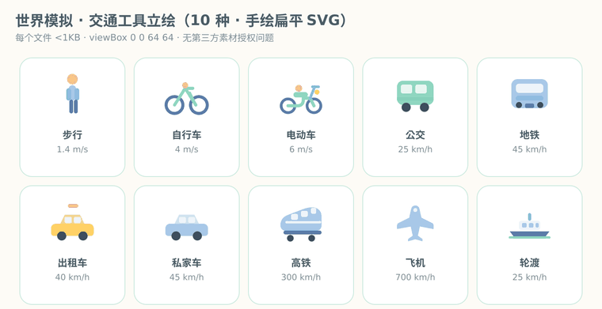
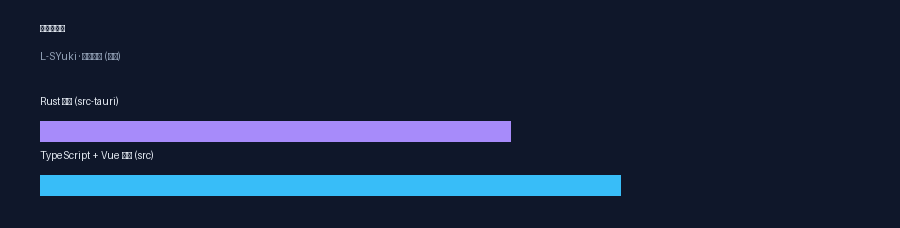
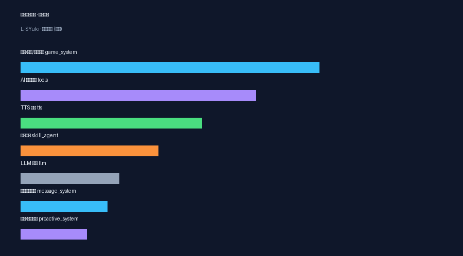
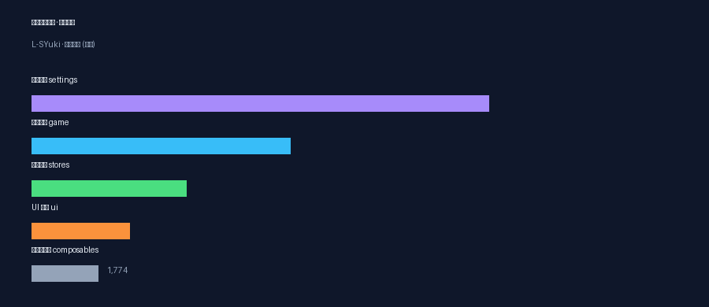

# SYuki · LingChat 改造版

<div align="center">

> 一个搭载了 SYuki「魂」的灵动 AI 陪伴助手
>
> 基于开源 [LingChat](https://github.com/SlimeBoyOwO/LingChat)（Tauri 2 + Vue 3 + Rust）深度改造，
> 把 SYuki 的差异化能力搬进 LingChat 原生体系。
>
> **正在长出第二层世界：把角色放进真实地图里生活。**

[](https://github.com/sukiiiimansui-dotcom/SYuki/releases/tag/v0.1.3)
[-red?style=flat-square)](https://github.com/sukiiiimansui-dotcom/SYuki/releases/tag/v0.1.3)
[](#-世界模拟world-sim)
[](https://www.rust-lang.org/)
[](https://vuejs.org/)

**L-SYuki** — 搭 LingChat 的车，注入 SYuki 的魂。

</div>

---

## 📖 目录

| | |
|---|---|
| [🌏 世界模拟（World Sim）](#-世界模拟world-sim) | **本项目当前的主攻方向** |
| [📥 下载 / Release](#-下载--release) | APK 与安装说明 |
| [🆕 最近更新](#-最近更新) | 本批都改了什么 |
| [📌 这是什么](#-这是什么) | 技术栈 / 代码规模 |
| [✨ 核心功能](#-核心功能) | SYuki 差异化能力清单 |
| [🎛️ 功能模块构成](#-功能模块构成) | 模块行数分布 |
| [🚀 快速开始](#-快速开始) | 环境 / 开发 / 构建 / 自检 |
| [🧩 移植对照](#-移植对照syuki--l-syuki) | SYuki 资产 → L-SYuki 落地 |
| [📦 仓库结构](#-仓库结构) | 目录说明 |
| [📄 上游与许可](#-上游项目与许可) | LingChat / AGPL-3.0 |

---

## 🌏 世界模拟（World Sim）

> **给 LingChat 加一层「真实世界」**：角色不再只活在对话框里 —— 他们有自己所在的城市、
> 会按日程出门、会在地图上被你看见、会遇上堵车和下雨，而这些都会**流回对话**
> （角色知道自己在哪、附近有什么、你离他多远）。

> ⚠️ **状态：开发中**。地图内核与后端链路已完成并通过全量编译；
> **真机运行验证尚未完成**，APK 构建暂时搁置。下面几张图是**后端真实渲染的地图**
> 套上合成外壳（手机上跑不了浏览器截图），地图内容是真的，外框是画出来的。

### 五层下钻：国 → 省 → 市 → 区县 → 小区

<p align="center">
  
  
  
</p>

<p align="center"><sub>全国首屏（只画省界，秒开） · 市级下钻 · 小区精绘（<b>地理位置是真的，街区布局是 AI 编的</b>）</sub></p>

- 首屏**只画省级轮廓（34 个省级区划）**，不画全国几千个区划 → 打开即秒开
- 行政区划走**本地缓存**，只有没去过的省市才联网
- 渲染用 **SVG** 而不是 PNG：一张 8–25KB（小一个数量级）、缩放不糊、中文交给系统字体、还能做图层开关和生长动画
- 深色主题：

<p align="center"></p>

### 世界会自己发生事情

**10 大类 41 条**现实事件，加权随机触发，带逐条冷却与全局节流（最短 5 分钟）：

| 类别 | 例子 | | 类别 | 例子 |
|---|---|---|---|---|
| 🌦 天气 | 下雨 / 下雪 / 大雾 / 高温 | | 💰 消费 | 打折 / 丢东西 / 捡到东西 |
| 🚦 交通 | 堵车 / 末班车 / 事故封路 | | ⚡ 意外 | 停电 / 停水 / 手机没电 |
| 👥 社交 | 朋友约饭 / 被搭话 / 偶遇 | | 🎉 节日 | 节日氛围 / 烟花 / 活动 |
| 💼 工作学习 | 加班 / 临时会议 / 考试 | | 😐 情绪 | 心情好 / 低落 / 烦躁 |
| 🩺 健康 | 感冒 / 失眠 / 身体不适 | | 🍀 小确幸 | 抽到想要的 / 踩到水坑 |

触发权重会随**时段、天气、所在场所、室内外、心情体力、你离他多远**动态修正 ——
深夜不会有人约你吃饭，雨天堵车概率翻倍。

事件通过**三条通道**让你知道：地图气泡、应用内提示、**以及角色自己下一轮会提起来**
（事件会写进对话上下文，角色是真的"记得"）。

### 角色在地图上生活

- **头像上地图**（类似高德）：每个角色一个头像标记，**跟随情绪切换**，重叠自动错开
- **AI 决定移动**：模型在回复末尾输出位置指令，角色沿路径走过去；
  **短途步行、长途自动选车**，速度可以是真实速率，也可以开 100× 加速
- **9 种出行方式 + 10 个扁平立绘**（每个 < 1KB，照 CC0 参考图重绘，无授权尾巴）：

<p align="center"></p>

- **点击角色看详情**：立绘侧边栏 + 七项信息（立绘 / 日程 / 位置 / 记忆 / 关系 / 对话 / 快捷动作）
- **玩家自己也有面板**：头像（可上传）/ 位置 / 时间天气 / 众人小地图 / 日程待办

### 地图注入对话上下文

AI 每轮都能看到这样一小段（**只在变化时更新**，不浪费 token）：

```text
【当前场景】
你在：广州市·越秀区·东山口·便利店里
用户位置：广州市·越秀区（约 330m）
时间/天气：17:56（傍晚）· 小雨 22°C
附近：咖啡馆(70m)、地铁站(190m)、公园(300m)
最近：刚才在便利店买了伞
```

另外给模型三个地图工具：`get_my_location` / `get_nearby_facilities` / `move_to`。

### 技术上的几个关键取舍

| 议题 | 做法 | 为什么 |
|---|---|---|
| 渲染格式 | **SVG**（不是 PNG） | 单张小一个数量级、缩放不糊、中文交给系统字体、可做图层与动画 |
| 定位 | **Android 原生 GPS 插件**（自写 Kotlin）+ 手动选点 + IP 兜底 | 官方 geolocation 插件在无 GMS 机型上必失败；`termux-location` 打包后不存在 |
| 地图数据源 | 区划走**本地缓存**，街区布局由 **LLM 生成** | 真实地理（真的）+ 虚构街区（编的），两者在界面上如实标注 |
| 移动位置 | 按**时间戳**插值，不靠定时器累积 | 手机息屏/切后台会冻结定时器，回到前台必须立刻自洽 |
| 指令剥离 | 剥在对话**流式切句之前**（`producer`） | 否则指令会流进情绪模型 / 翻译 / TTS / 历史行 / 前端事件 |
| 对上游的兼容 | 世界模拟**没打开**时，对话管线逐字节不变 | 这套东西将来要以 PR 形式提给上游，不能改动官方行为 |

<details>
<summary><b>📂 世界模拟的代码在哪 / 文档在哪</b>（点开）</summary>

| 位置 | 内容 |
|---|---|
| `src-tauri/src/world_map/` | **地图内核（Rust）**：坐标 / 区划 / 渲染 / 草图 / 流式生成 / 地图库 / 设施 / 交通 / 日程 / 定位天气 / 运行时状态 / 位置指令 / 行程状态机 / 事件引擎（24 个模块，约 20k 行） |
| `src/components/views/worldsim/` | 世界模拟前端：入口 / 三级选择器 / 区县与小区地图 / 人物层 / 立绘侧边栏 / 角色与自己的面板 / 行程卡 / 交通工具 |
| `src/composables/useWorldSim*.ts`、`useWorldTrip*.ts` | 状态机 / 取图 / 手势 / 行程数据层 |
| `src-tauri/src/ai_service/tools/world_map.rs` | 三个地图工具（按官方 `docs/function_call/extension.md` 的三步扩展法接入） |
| `src-tauri/gen/android/.../location/LocationPlugin.kt` | 自写的 Android 定位插件（GPS 那条路） |
| [`docs/world-map/`](docs/world-map/) | **19 篇设计文档**：分层世界结构 / 统一坐标 / 渲染方案 / AI 生成街区 / 手机端专项 / 与 LingChat 结合 / 接入实施 / 与 0.5.x 适配 / 完成度评估 / 需求问卷 / 实施方案 / **最终方案** / 架构地图 / PR 操作手册 / 进度总表 |
| [`.github/workflows/world-map-check.yml`](.github/workflows/world-map-check.yml) | 世界地图的 CI：4 平台 cargo check + 前端 vue-tsc/vite build + 单测 |

</details>

### 进度

| 部分 | 状态 |
|---|---|
| 地图内核（Rust 24 模块） | ✅ 完成，全量 `cargo check` 通过（0 error） |
| 五层下钻 / 定位 / 三级选择器 / 小区生成 | ✅ 完成 |
| 人物层 / 立绘侧边栏 / 角色与自己的面板 | ✅ 完成 |
| 注入对话上下文 + 三个地图工具 | ✅ 完成（**默认需在设置里开启工具权限**，位置信息走注入不依赖工具） |
| AI 位置指令 → 地图移动 + 行程卡 | ✅ 后端完成 / 前端完成，**真机未验证** |
| 现实事件引擎（10 类 41 条 + 三通道通知） | ✅ 后端完成 / 前端开发中 |
| 存档联动 / 事件写记忆 / 玩家干预 / 离线与性能 | 🚧 规划中（见 [进度总表](docs/world-map/19-世界模拟·实现进度总表.md)） |
| 真机运行验证 / APK | ⛔ 按计划搁置 |

> 📌 完整的需求决策、架构设计与完成度评估都在 [`docs/world-map/`](docs/world-map/)。
> 进度总表（卡片 ↔ 代码对照）见 [19-世界模拟·实现进度总表](docs/world-map/19-世界模拟·实现进度总表.md)。

---

## 📥 下载 / Release

> ⚠️ **平台说明：目前仅提供 Android APK，iOS / Windows / Linux / macOS 等平台暂未提供**（受技术、版权、发布与分发流程等因素限制）。跨平台适配与发布尚未打通。

- **v0.1.3（pre-alpha，含大量 bug，仅作尝鲜）** → [GitHub Release](https://github.com/sukiiiimansui-dotcom/SYuki/releases/tag/v0.1.3) · 资产 `SYuki-v0.1.3-universal.apk`（universal 全 ABI，已签名、可安装）
- 安装包与说明见 [`RELEASE_NOTES.md`](RELEASE_NOTES.md)（含已知问题 / 平台说明）。
- 反馈 / 提 issue → [Issues](https://github.com/sukiiiimansui-dotcom/SYuki/issues)；当前为快速迭代 pre-alpha，接口 / 存储可能随时变动。
- ⚠️ **世界模拟功能尚未进入 Release 包**（开发中），需要自行从源码构建。

---

## 🆕 最近更新

### 世界模拟（进行中，当前主攻方向）

给 LingChat 加一层真实世界 —— 详见上面 [🌏 世界模拟](#-世界模拟world-sim)。

### 本批移植更新（2026-09-05）

把官方 LingChat 的新功能逐个搬进 L-SYuki 旧结构（**只换代码、不改仓库结构，保留全部 SYuki 功能**）。本批完成：

- **⚡ 演出流畅度（治卡）**：消息合并 + 事件队列调度优化，同角色连续短句自动合并续打，减少切句闪断。
- **🎙️ 语音输入 ASR**：手动麦克风 + 自动监听，统一采集/识别/流式（VAD 端点检测 + 多 provider），设置含总开关。
- **📝 台词融合 + 动作优化**：连续台词/动作按段合并续打（`charReveal` 逐字符渲染）。
- **🎛️ 设置页重排**（部分）+ **web 投影入口**（`SettingsCast`，后端 cast 服务暂缓）。

> 详见下方「✨ 核心功能」清单（🆕 标记本批新增项），并参见 [RELEASE_NOTES.md](RELEASE_NOTES.md)。

---

## 📌 这是什么

`SYuki` 是基于开源项目 **LingChat**（Tauri 2 + Vue 3 + Rust，聊天 + 剧本引擎 + 角色卡）改造的 AI 陪伴 App。
目标是「搭 LingChat 的车，注入 SYuki 的魂」——把 SYuki 特色的 B站学习 / 网易云音乐 / 分层记忆 / 主动心跳等能力，以 LingChat 原生方式迁移进来；
并在此之上新增**世界模拟**（真实地图 + 角色在地图上生活）。

主要技术栈：

| 层 | 技术 |
|---|---|
| 界面 | Vue 3 + TypeScript + Tailwind |
| 后端 | Rust（Tauri 2）+ onnxruntime（本地 TTS / 情绪模型） |
| 地图 | Rust 生成 SVG + Android 原生定位插件（Kotlin）+ 区划本地缓存 |
| 内核 | 角色卡 / 剧本引擎 / 技能代理 / 主动系统 / 记忆库 / 插件沙箱 |

### 代码规模

| 模块 | 行数 |
|---|---|
| Rust 后端（`src-tauri`） | ~52.8k |
| TS + Vue 前端（`src`） | ~65.2k |
| ↳ 其中 **世界模拟**（Rust ~20k + 前端 ~8k） | **~28k** |



---

## ✨ 核心功能

LingChat 原生已内置：角色卡换装 / 立绘、剧本引擎（多事件 + script_editor）、技能 Agent、上帝 Agent、主动系统、工具 function-calling、多 TTS 适配器、记忆库、局域网同步、插件沙箱、番茄钟 / 日程 / 成就。

**SYuki 差异化能力：**

0. **🌏 世界模拟（本仓库当前主攻方向）**：真实地理五层下钻（国→省→市→区县→小区）、角色头像上地图、AI 决定移动、
   10 类 41 条现实事件、地图状态注入对话上下文。详见 [🌏 世界模拟](#-世界模拟world-sim)。
1. **🧠 分层记忆系统（L1-L4）**：每角色独立记忆库，自动压缩 短期回顾 / 长期经历 / 用户画像 / 约定，多记忆不混。
2. **🎵 网易云音乐**：搜索 / 心情推荐 / **App 级全局后台播放**（切页/玩游戏不停，独立音量），AI 可发歌给前端自动播。
3. **📺 B站学习**：为 AI 提供 B站网络文化（热榜 / 搜索 / 弹幕梗 / 高赞评论学习库），AI 可按聊天趋向自主搜索并灵活调用工具。
4. **💗 主动 + 心跳系统**：用户离开一段时间 → AI 主动想念搭话；主动投放可走上帝 Agent 多角色自主接话。
5. **🌐 AI 工具系统**：搜索 / 天气 / 音乐 / 屏幕 / 休息等，AI function-calling 灵活调用，全部开关可在设置界面一键启用。
6. **🧠 记忆可视化**：记忆图谱 · **无限沙盒**（自由缩放/拖动）· **分层视图**（L1 近期 / L2 长期 / L3 用户 / L4 约定 4 大球 + 食物链方向连线）· **点大球展开该层记忆** · **点记忆球查看「关联最强 Top-4」浮窗** · **类别卡片**（长条区块点击展开）· **情绪雷达**（五维心情 + 时间线）· **小窗悬浮**（可拖拽 / 最小化 / 全屏）。
7. **📈 主动状态可视化 + 心跳/主动专用日志**：AI 是否在想念（运行状态 / 想念次数 / 兴趣值 / 当前感知 / 待投放队列），主动事件写入 `data/log/heartbeat/heartbeat_YYYYMMDD.log`。
8. **⚡ 演出流畅度（本批移植）**：消息合并 + 事件队列调度优化 —— 同角色连续短句自动合并续打、AUTO 与台词合并共用单管道调度，减少切句闪断/卡顿。位置：`src/core/events/dialogue-merge.ts`（合并状态）、`src/core/events/event-queue.ts`（武装判定+队列）、`src/components/views/MainChat.vue`（自动推进/合并调度）、`src/components/game/standard/GameDialog.vue`（合并追加显示）、`src/stores/modules/settings/index.ts`（`mergeLineThreshold/mergeLineDelay/autoAdvanceDelay` 配置）。
9. **🎙️ 语音输入 ASR（本批移植）**：手动麦克风 + 自动监听；统一采集/识别/流式（VAD 端点检测 + 多 provider），识别结果填入输入框；设置含 `voice_input_enabled` 总开关。位置：`src/composables/useAsrInput.ts`（统一采集+识别）、`src/api/services/asr.ts`（后端命令封装）、`src/stores/modules/settings/asr.ts`（ASR 设置 store）、`src/components/game/standard/GameDialog.vue`（mic 按钮）、Rust `src-tauri/src/ai_service/asr/` + `src-tauri/src/api/asr.rs`。
10. **🎛️ 设置页重排（本批移植，部分）**：设置导航/面板重构 + 新增 `SettingsAdvanceMenu`、`SettingsCast`（web 投影入口，预留给后续）；`Button`/`PluginTag`/`codex`/`tts-cosyvoice` 等。位置：`src/components/settings/`、`src/api/services/codex/`、`src/api/services/tts/tts-cosyvoice.ts`。注：官方 `SettingsText/Background/Tts` 深度改写依赖官方专属后端（`gpu-perf`/`hdr`/`vite-devtools` 等），已回退到旧结构可用版（暂缓）。
11. **📝 台词融合 + 动作优化（本批移植）**：连续台词/动作按段合并续打，`charReveal` 逐字符淡入渲染（台词/动作双容器），`mergeMotionMode`（append/replace）控制动作段处理。位置：`src/utils/typewriter/charReveal.ts`、`src/components/game/standard/GameDialog.vue`、`src/stores/modules/settings/index.ts`（`mergeMotionMode`）。

> 所有移植功能的开关都已注册进设置界面（`config/tree.rs` → 设置面板「高级设置」），像 LingChat 原生功能一样可开可关。

> 📌 **状态**：世界模拟（开发中）/ 治卡 / ASR / 设置页重排（部分）/ 台词融合+动作优化 已完成（见清单）；**web 投影** 因依赖官方 Rust cast 后端（抓屏/麦克风/HTTP server，平台相关）**暂缓**。设置页与台词融合当前在各独立分支（`task/settings-dev`、`task/dialogue-dev`），合入 main 后同步更新本页。

---

## 🎛️ 功能模块构成

| 后端模块 | 行数 | 前端模块 | 行数 |
|---|---|---|---|
| 游戏/角色/记忆系统 | 6624 | 设置界面 | 12134 |
| AI 工具系统 | 5227 | 游戏渲染 | 6880 |
| TTS 语音 | 4028 | 状态管理 | 4112 |
| 技能代理 | 3058 | UI 组件 | 2612 |
| LLM 接入 | 2191 | 组合式函数 | 1774 |
| 对话消息系统 | 1927 | | |
| 主动/心跳系统 | 1463 | | |



<br/>



---

## 🚀 快速开始

### 环境
- Rust（stable）+ Android NDK（构建 APK 用）
- Node.js + pnpm（前端）
- Android SDK

### 开发运行

```bash
pnpm install
pnpm tauri dev        # 桌面端开发
```

### 构建 Android APK

```bash
bash build_setup.sh                 # 一次性准备环境（rustup + ndk + target）
node scripts/prepare-bundled-resources.mjs 9   # 打包 data.7z
pnpm tauri android build --target aarch64     # 构建 arm64 APK
```

> 本机构建若遇 `ort-sys` 报 `could not determine cache directory`，设置 `ORT_CACHE_DIR` 环境变量绕过：
> `ORT_CACHE_DIR=$HOME/.cache/ort cargo build --lib`

### 只验世界地图（轻量，不用全量编译）

```bash
npx vue-tsc --noEmit --skipLibCheck && npx vite build   # 前端类型 + 构建
cargo check --manifest-path src-tauri/Cargo.toml        # Rust 编译检查
```

> 世界地图有独立 CI：[`.github/workflows/world-map-check.yml`](.github/workflows/world-map-check.yml)
> （4 平台 cargo check + 前端 vue-tsc/vite build + 单测）。

---

## 🧩 移植对照（SYuki → L-SYuki）

| SYuki 资产 | L-SYuki 落地 |
|---|---|
| `setting_prompt.txt` 人设 | 角色卡 `settings.yml` 的 `system_prompt` |
| `rikka_memory.db`（L1-L4） | `memory_bank` 表 + `PersistentMemorySystem`（按角色隔离） |
| `jukebox_engine` / `music_login` | `netmusic_service` + `tools/netmusic` + 全局播放器 |
| `bili_learn` | `bilibili_service` + `tools/bilibili` + 知识注入对话 |
| `emotion_engine` | `emotion/classifier`（ONNX） |
| `autopilot`（主动） | `proactive_system` + `god_agent` |
| **（新增）世界模拟** | **`src-tauri/src/world_map/` + `src/components/views/worldsim/`** —— 不是移植，是本仓库新增的能力 |

---

## 📦 仓库结构

> **源代码区分**：本仓库主体是 **L-SYuki 改造版**；原版上游 LingChat 的说明归置在 `upstream/`。

### 🧩 原版 vs 改造版

| 路径 | 说明 |
|---|---|
| **`upstream/`** | 原版上游 LingChat → 来源说明 / 许可参考（见 `upstream/README.md`） |
| **代码区（本仓库）** | 下图中的 `src/`、`src-tauri/` 等，即 **L-SYuki 改造版** |

### 📁 目录

```
upstream/         原版上游 LingChat（来源标识 / 许可参考）

src/              Vue3 前端（界面 / 视图 / 组件 / store）        ← L-SYuki
  components/views/worldsim/   🌏 世界模拟前端（入口 / 地图 / 人物 / 面板 / 行程）
src-tauri/        Rust 后端（Tauri 2，RustPython 插件沙箱）      ← L-SYuki
  src/world_map/               🌏 地图内核（坐标/区划/渲染/设施/交通/事件，24 模块）
  src/ai_service/              核心：记忆 / 主动 / 工具 / TTS / 剧本引擎
  gen/android/.../location/    🌏 自写 Android GPS 定位插件（Kotlin）
data/game_data/  角色卡 / 剧本 / 资源                           ← L-SYuki
scripts/         构建脚本（prepare-bundled-resources 等）        ← L-SYuki
docs/            文档与资产
  world-map/                   🌏 世界模拟 19 篇设计文档
  assets/worldsim/             🌏 世界模拟界面图
```

---

## 📄 上游项目与许可

本仓库基于 [LingChat](https://github.com/SlimeBoyOwO/LingChat) 改造，遵循其开源许可。原项目功能与社区支持请见上游仓库。

- **许可证**：**GNU Affero General Public License v3.0（AGPL-3.0）**（完整文本见 [`LICENSE`](LICENSE)）
- **署名与修改说明**：见 [`NOTICE`](NOTICE)（Copyright © SlimeBoyOwO；本仓库为 L-SYuki 改造版，修改项见 [`docs/L-SYuki-changes.md`](docs/L-SYuki-changes.md)）
- **源码区分**：原版上游说明见 [`upstream/`](upstream/)，本仓库代码区（src / src-tauri / data）为 L-SYuki 改造版
- **世界模拟**：本仓库新增能力，目前**只在 L-SYuki 线**（`feat/world-map`）；将来若以 PR 形式提给上游，会单独走一条只含地图改动的分支

---

## 📚 相关文档

- [🌏 世界模拟 · 设计文档（19 篇）](docs/world-map/) —— 分层世界结构 / 统一坐标 / 渲染方案 / AI 生成街区 / 手机端专项 / 与 LingChat 结合 / 接入实施 / 与 0.5.x 适配 / 完成度评估 / 需求问卷 / 实施方案 / **最终方案** / 架构地图 / PR 操作手册 / **进度总表**
- [SYuki 源项目 · 具体功能说明](docs/SYuki-original-features.md) —— 改造前的原 SYuki 全部功能
- [L-SYuki · 我们改了什么](docs/L-SYuki-changes.md) —— SYuki → L-SYuki 迁移对照与本仓库改动详解

---

<div align="center">

**L-SYuki · 一个会记着你、会想你、会陪你学习、还和你住在同一座城市里的 AI 陪伴。**

</div>
